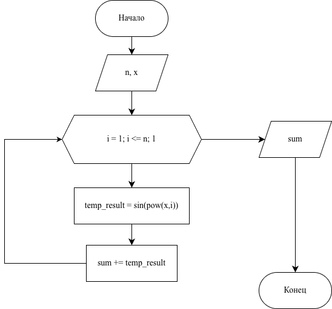

# Домашнее задание к работе 8

  

## Условие задачи

##### sin(x)+sin(x^2)+sin(x^3)+…+sin(x^n)

---


## 1. Алгоритм и блок-схема

### Алгоритм

1. Начало

2. Ввод натурального значения:
	- `n`
3. Ввод действительного значения:
	- `x`
4. Инициализация:
	- `sum = 0.0`
5. Цикл for от 1 до n (`for (int i = 1;i <= n; i++)`):
	- Вычислить `temp_result = sin(pow(x,i))`
	- Прибавить `temp_result` к `sum`: `sum += temp_result`
6. Вывод переменной: `sum`
7. Конец

### Блок-схема



  

[Ссылка на draw.io](https://viewer.diagrams.net/?tags=%7B%7D&lightbox=1&highlight=0000ff&edit=_blank&layers=1&nav=1&title=%D0%94%D0%97%20%E2%84%968.drawio&dark=auto#Uhttps%3A%2F%2Fdrive.google.com%2Fuc%3Fid%3D1mkxpoCGRR_MUl8Z_JYJAqqNC5l81sxzE%26export%3Ddownload)

---

  

## 2. Реализация программы

```c
#include <stdio.h>
#include <math.h>
#include <locale.h>

int main() 
{
    setlocale(LC_ALL, "RUS");
    int n;
    double temp_result;
    double x, sum = 0.0;

    printf("Введите натуральное число n: ");
    scanf("%d", &n);

    printf("Введите действительное число x: ");
    scanf("%lf", &x);

    for (int i = 1; i <= n; i++)
    {
        temp_result = sin(pow(x, i));
        sum += temp_result;
    }

    printf("Результат: %g\n", sum);
    return 0;
}

```

# 3. Результаты работы программы

```bash
Введите натуральное число n: 5
Введите действительное число x: 8.4
Результат: 3.67775
```

# 4. Информация о разработчике

#### Сафонов Павел Романович бИПТ-251